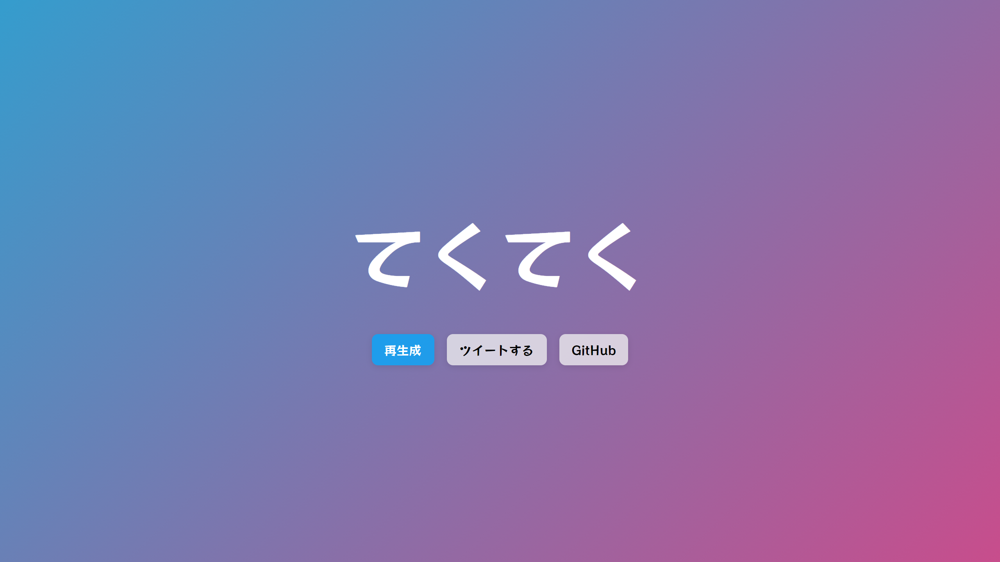

# GION

## What is this
Want to generate some Japanese onomatopoeia? This tool will help you with that!

「ぬくぬく」「ぽんぽん」といった2×2から構成されるひらがなを生成します。「#擬音ジェネレーター」でツイートしよう。

Let's tweet with the hashtag #擬音ジェネレーター .
